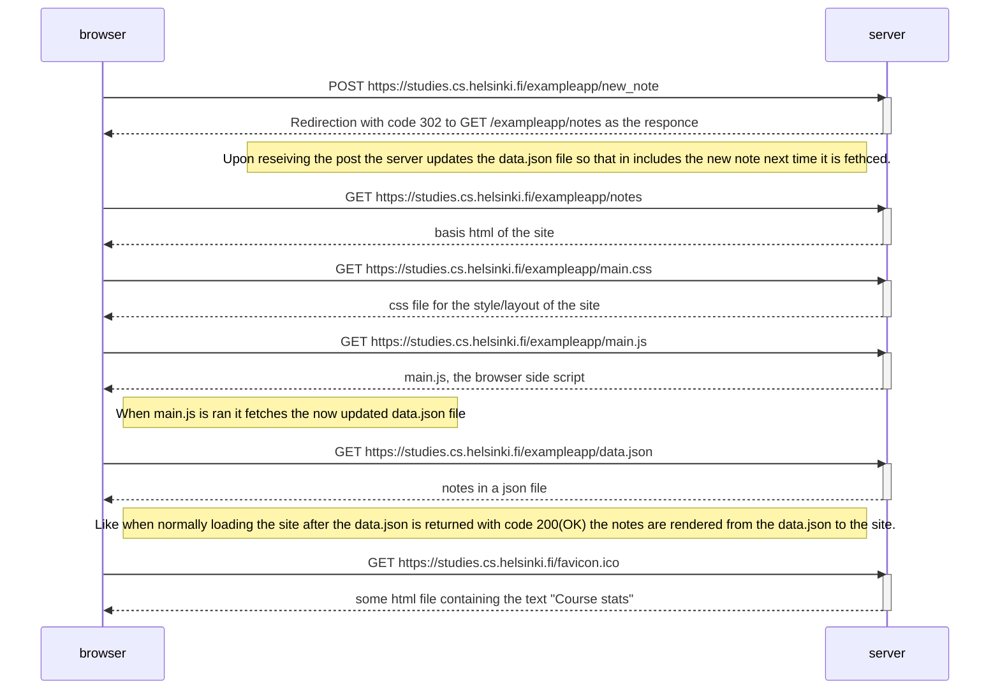

```mermaid
sequenceDiagram
	participant browser
	participant server

	browser->>server: POST https://studies.cs.helsinki.fi/exampleapp/new_note
	activate server
	server-->>browser: Redirection with code 302 to GET /exampleapp/notes as the responce
	deactivate server
	
	Note left of server: Upon reseiving the post the server updates the data.json file so that in includes the new note next time it is fethced.

	browser->>server: GET https://studies.cs.helsinki.fi/exampleapp/notes
	activate server
	server-->>browser: basis html of the site
	deactivate server

	browser->>server: GET https://studies.cs.helsinki.fi/exampleapp/main.css
    	activate server
    	server-->>browser: css file for the style/layout of the site
    	deactivate server
    
    	browser->>server: GET https://studies.cs.helsinki.fi/exampleapp/main.js
    	activate server
    	server-->>browser: main.js, the browser side script
    	deactivate server
	
	Note right of browser: When main.js is ran it fetches the now updated data.json file

	browser->>server: GET https://studies.cs.helsinki.fi/exampleapp/data.json
	activate server
	server-->>browser: notes in a json file
	deactivate server
	
	Note right of browser: Like when normally loading the site after the data.json is returned with code 200(OK) the notes are rendered from the data.json to the site.
	
	browser->>server: GET https://studies.cs.helsinki.fi/favicon.ico
	activate server 
	server-->>browser: some html file containing the text "Course stats"
	deactivate server
	
```
