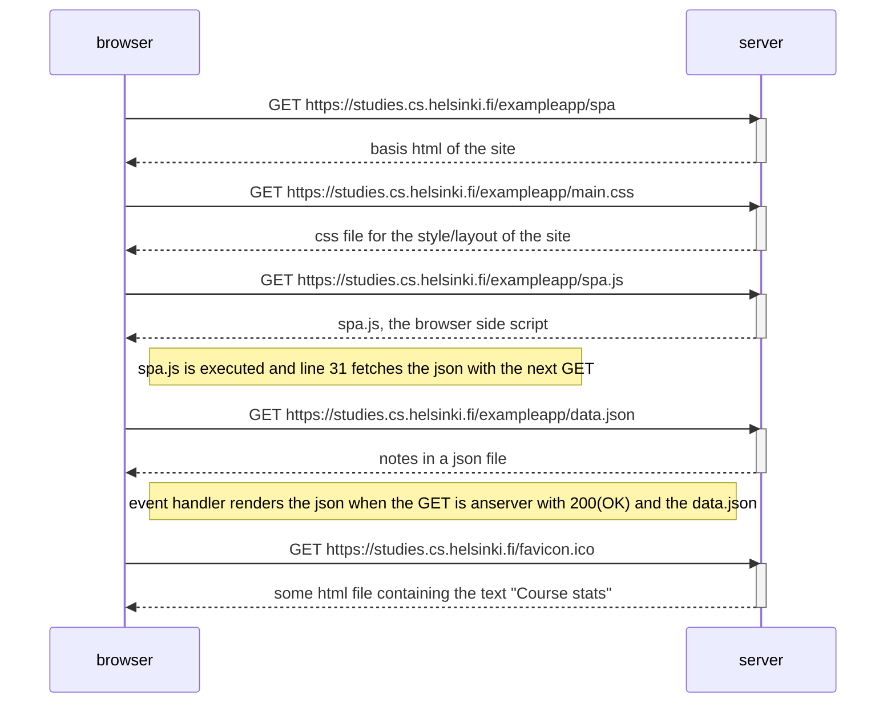

```mermaid
sequenceDiagram
	participant browser
	participant server

	browser->>server: GET https://studies.cs.helsinki.fi/exampleapp/spa
	activate server
	server-->>browser: basis html of the site
	deactivate server

	browser->>server: GET https://studies.cs.helsinki.fi/exampleapp/main.css
  activate server
  server-->>browser: css file for the style/layout of the site
  deactivate server
    
  browser->>server: GET https://studies.cs.helsinki.fi/exampleapp/spa.js
  activate server
  server-->>browser: spa.js, the browser side script
  deactivate server
	
	Note right of browser: spa.js is executed and line 31 fetches the json with the next GET

	browser->>server: GET https://studies.cs.helsinki.fi/exampleapp/data.json
	activate server
	server-->>browser: notes in a json file
	deactivate server
	
  Note right of browser:  event handler renders the json when the GET is anserver with 200(OK) and the data.json
	
	browser->>server: GET https://studies.cs.helsinki.fi/favicon.ico
	activate server 
	server-->>browser: some html file containing the text "Course stats"
	deactivate server
	
```
