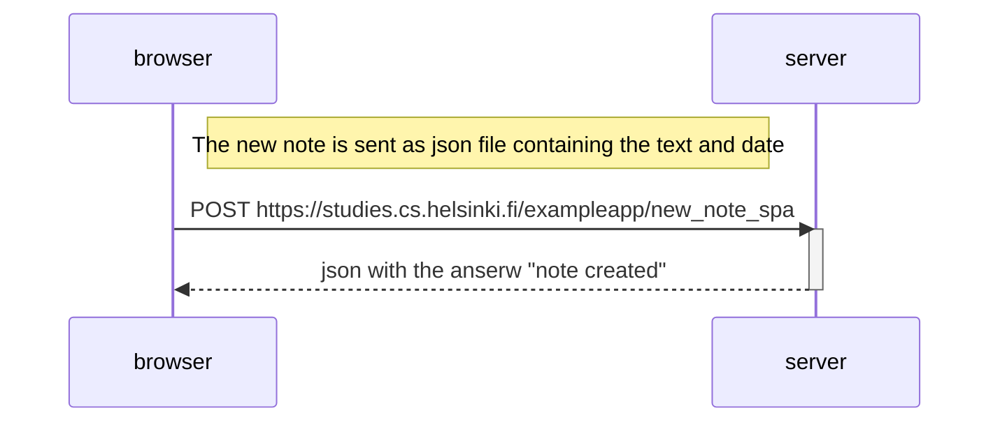

```mermaid
sequenceDiagram
	participant browser
	participant server
  
  Note right of browser: The new note is sent as json file containing the text and date
	browser->>server: POST https://studies.cs.helsinki.fi/exampleapp/new_note_spa
	activate server
	server-->>browser: json with the anserw "note created"
	deactivate server
  
```
